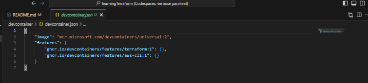

## Day 1: Getting Started with Terraform

### What is Terraform ?

Terraform is a declarative coding tool that enables developers to use a high-level configuration language called HashiCorp Configuration Language (HCL) to describe the desired “end-state” cloud or on-premises infrastructure for running an application. It then generates a plan for reaching that end-state and runs the plan to provision the infrastructure.

Infrastructure as code can help with the following:

- Improve speed: Automation is faster than manually navigating an interface when you need to deploy or connect resources.

- Improve reliability: If your infrastructure is large, it becomes easy to misconfigure a resource or provision services in the wrong order. With IaC, the resources are always provisioned and configured exactly as declared.

- Prevent configuration drift: Configuration drift occurs when the configuration that provisioned your environment no longer matches the actual environment.

### Installing Terraform on MacOS, Linux and Windows

Get your hands dirty by installing Terraform on both MacOS, Linux and Windows. Follow this page for installation proccess depending on your environnment https://developer.hashicorp.com/terraform/install?product_intent=terraform

I choose codespace environment for quick setup and usage. beow are the steps:

- Add following extensions Aws, Terraform to the codespaces environment:

- Configuration for container running in codespace:

#### Setting up Terraform for AWS

Dive into AWS integration with Terraform. You'll learn how to set up your AWS credentials and configure the AWS provider within Terraform to start provisioning resources.

#### Writing Your First Terraform Code

Start writing actual Terraform code with a simple example. Learn about the basic structure of a Terraform configuration file and how to define resources using the HCL language.

### Terraform Lifecycle

Understand the lifecycle of terraform. What is terraform `init`, `plan` and `apply`.

#### Launching an EC2 Instance

Take your skills up a notch by provisioning an EC2 instance on AWS using Terraform. Explore attributes like instance type, AMI, and tags to customize your instance.

#### Terraform State Basics

Understand the importance of Terraform state files. Learn about desired and current states, and how Terraform manages these states to ensure infrastructure consistency.